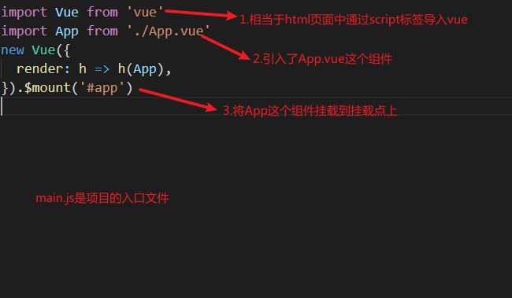

1 模块化

```
//es6 模块化的方案
```

#### 1-1 导出

```js
//node.js
module.exports = {};
//es6
export default  {
    
}
```

#### 1-4 导入

```js
//node.js
const app = require("./App.vue");
//es6
import app from './App.vue';
```

## 2  项目说明

```
//main.js
```



## 作业

```
//1.从0到1实现一个hello world
//2. vue-cli读取top250;
//3. vue-cli实现todoList
```

## 3 组件语法

```
1.在组件的html中,根元素的div只能有一个
2.在js中,data是函数
3.for循环必须加key
```

```js
<template>
  <div>
    {{ msg }}
    <div v-for="item of arr" :key="item.id">{{item.name}}</div>
  </div>
</template>
<script>
export default {
  name: "App",
  data() {
    return {
      msg: "data",
      arr:[
        {name:"html",id:1001},
        {name:"css",id:1002}
      ]
    };
  },
  mounted() {
    http();
  },
};
</script>
```

## 4 安装其他的模块

#### 1-1 安装

```
yarn add axios
cnpm i axios -S
```

#### 1-2 导入模块发送http请求

```js
<template>
  <div>
     hello world
  </div>
</template>
<script>
import axios from 'axios';
export default {
  name: "App",
  mounted(){
    let url  = "http://192.168.4.20:8000/top250";
    axios.get(url).then(res=>{
      console.log(res)
    })
  }
};
</script>
```


## eslint规范

```
https://github.com/airbnb/javascript
```

```
vue是单页面应用;不同的路由对应不同的组件,当切换路由时,是将路由后面对应的组件装载到挂载点中。
```

```
//单页面应用的好处
1.页面是由组件组成的,代码高度复用。
2.路由切换的时候,http请求不会重复加载。
```

