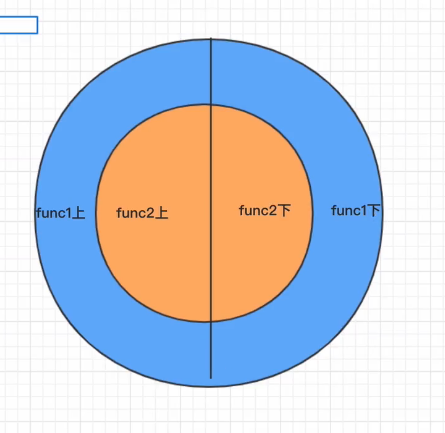

## 中间件

> 匹配路由之前和路由完成之后进行的操作就叫中间件

## 1-1 中间件函数

```js
const koa = require("koa");
const app = new koa();
/* 
app.use()中间件  -->就是一些第三方的模块
特点:
1.一个应用程序是可以有多个中间件
 */
/* next就是下一个中间函数 */
app.use(async (ctx,next)=>{
    console.log(1)
    console.log(next())
})
app.use(async ctx=>{
    console.log(2)
    return 3;
})
app.listen(8080)
```

## 1-2 中间件next()

> 想执行下一个中间件,必须调用next()

```js
const koa = require("koa");
const app = new koa();
/* 
app.use()中间件  -->就是一些第三方的模块
特点:
1.一个应用程序是可以有多个中间件
 */
/* 
1.next就是下一个中间函数
2.调用next()的时候下个中间会执行
3.阻塞了当前函数
 */
app.use(async (ctx,next)=>{
    console.log(1)
    var res = await next();
    console.log(res);
})
app.use(async ctx=>{
    console.log(2)
    return 3;
})
app.listen(8080)
```

## 1-3 洋葱模型

```
const koa = require("koa");
const app = new koa();
/* koa洋葱模型 */
app.use(async (ctx,next)=>{
    console.log(1)
    await next();
    console.log(4)
})
app.use(async (ctx,next)=>{
    console.log(2)
    await next();
    console.log(3)
    
})
app.listen(8080)
```



## 1-4 安装路由中间件

```js
# 1.安装依赖
cnpm i koa-router -S
```

```js
# 2.导入模块并配置
const koa = require("koa");
const app = new koa();
const Router = require("koa-router");
const router = new Router();
router.get("/",async ctx=>{
    ctx.body = "hello world"
})
app.use(router.routes());
app.listen(8080)
```

## 1-5 使用cheerio解析html

```
cnpm i cheerio -S
```

```js
const koa = require("koa");
const app = new koa();
const Router = require("koa-router");
const router = new Router();
const axios = require("axios");
const cheerio = require("cheerio");
const url = "https://movie.douban.com/top250"
router.get("/douban",async ctx=>{
    var html = await axios.get(url);
    const $ = cheerio.load(html.data,{
        decodeEntities:false   //解码设置为false,中文不会乱码
    });
    var title = $("#content h1").html();
    console.log(title)
    ctx.body = title;
})
app.use(router.routes());
app.listen(8080)
/* 
1.axios抓取豆瓣
2.cheerio解析页面
3.返回数据给前端
 */
```


```
//http://www.kuwo.cn/playlists
# 抓取酷我音乐 [{imgUrl:"xxx",name:"xxxx",playCount:xxx}]
```

## 接口文档

### 2-1 列表页

```
//locahost?start=0 默认地址 默认获取25条,想去获取下一个只用更改start值就可以了
//locahost?start=25
```

### 2-2 详情页的数据

```
/subject/:id
```

```
前后端接口联调
```

### 2-3 搜索页的数据

```
/search?keyword=value
```


```
http://www.kuwo.cn/playlists
抓取酷我搜索页
```

