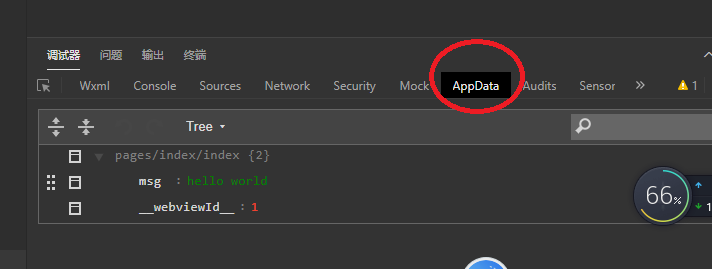

### 1 小程序的项目配置文件

```
app.json //只用关注这个文件
```

### 2 小程序中的文件

```
index.js --javascript
index.wxml -- html
index.wxss --css
```

### 3 新配置一个页面

```
//app.json文件中进行注册  之后点击客户端的编译
```

```
//规则:谁处于pages这个数组的第一项,那么谁就是入口文件
{
  "pages":[
    "pages/detail/detail",  //入口文件
    "pages/index/index"
  ]
 }
```

### 4 小程序中的标签

```
view --> div
img  --> image
p    --> text
button --> button
form --> form
input --> <input></input>
```


#### 4-1 小程序中图片的绝对路径

```
<image src="/images/bg.jpg" >
   
</image>
```

>  Tip:小程序没有背景图片的写法，iconfont不能使用。

```
// 没有i,em,span,strong
```

### 5 使用动态数据

```
//index.js
Page({
    data:{
        msg:"hello world"
    }
})
```

```
//index.wxml
<view>
//插值表达式  可以在里面使用变量,可以在里面写js表达式
	{{msg}}
</view>
```



### 6 事件修改data中的数据

```
onclick --> bindtap
```


```
# keyCode
this.setData() //可以修改data中的数据
```

```
<view  bindtap="handleClick">
   {{msg}}
</view>
```


```\
Page({
    ...
    handleClick(){
        this.setData({
            msg:"change"
        })
    }
})
```

#### 6-1  input

```js
onfocus-->bindfocus
          bindinput  输入的时候触发
          bindconfirm  event.keyCode==13
<!-- focus的值为true就会自动获取焦点 -->
<input type="text" 
focus="{{isFocus}}"
bindfocus="onFocus"></input>
```

#### 6-2 form

> Tips: 事件放在form表单上,button的type是使用form-type

```js
<form  bind:submit="handleSubmit" >
   <input type="text"  name="keyword" placeholder="请搜索"/>
   <button form-type="submit">搜索</button>
</form>
```

```js
Page({
    handleSubmit(event){
        console.log(event.detail.value)
    }
})
```

### 7 wx:for

```js
Page({
	data:{
        arr:[{name:"html"},{name:"css"}]
	}
})
```

```js
<view wx:for="{{arr}}">{{item.name}}</view>
```

### 8 三目运算

```
//获取data中的值
this.data.attrName
```


```js
<image class="music" src="{{isPlay?'/images/play.png':'/images/pause.png'}}"
bindtap="handleMusic">
   
</image>
```

```js
Page({
    data:{
        isPlay:false
    },
    handleMusic(){
        // this.data.attr  可以获取data中的值
        // console.log(this.data.isPlay)
        // if(this.data.isPlay){
        //     this.setData({
        //         isPlay:false
        //     })
        // }else{
        //     this.setData({
        //         isPlay:true
        //     })
        // }
        this.setData({
            isPlay:!this.data.isPlay
        })
    }
})
```

### 9 小程序的生命周期

```
onLoad() 页面加载的时候触发
onShow() 页面显示的时候触发
onReady()  页面已经渲染完成触发
```

```
一般情况下,http请求,在onLoad()或者onShow()这两个生命周期函数中进行发送。
```

### 10 发送http请求this指向的问题

```js
onLoad: function (options) {
    var self= this;
    var url = `http://192.168.4.18:3000/search?keywords=你&type=10`
    wx.request({
      url,
      data: {},
      header: { 'content-type': 'application/json' },
      method: 'GET',
      dataType: 'json',
      responseType: 'text',
      /* 回调函数写成function涉及到this指向的问题 */
      success: function (res) {
        console.log(this)
        console.log(res.data.result.albums)
        self.setData({
          musics:res.data.result.albums
        })
      }
    });
  },
```

### 11 箭头函数解决this关键字指向

```js
onLoad: function (options) {
    var url = `http://192.168.4.18:3000/search?keywords=你&type=10`
    wx.request({
      url,
      data: {},
      header: { 'content-type': 'application/json' },
      method: 'GET',
      dataType: 'json',
      responseType: 'text',
      /* 回调函数写成function涉及到this指向的问题 */
      success: res => {
        console.log(this)
        console.log(res.data.result.albums)
        this.setData({
          musics:res.data.result.albums
        })
      }
    });
  },
```

### 12 模块化

```
//使用node.js的模块化方案
```

### 13 data-id自定义属性

> 小程序中如何获取自定义属性的值

```
<image bindtap="handleClick"  data-id="{{item.id}}"></image>
```

```js
handleClick(event){
    console.log(event.currentTarget.dataset)
  }
```

### 14  实现按钮的切换

#### 1-1   当前项目id和点击之后的id值不同的情况 

```js
 <image bindtap="handleClick"  data-id="{{item.id}}" 
    src="{{playStates[item.id]?'/images/play.png':'/images/pause.png'}}"></image>
```

```js
// pages/http/http.js
const http = require("../../models/http.js")
Page({

  /**
   * 页面的初始数据
   */
  data: {
    /* 记录已经点击了的id */
    prevId: "",
    /* 存所有item播放的状态 */
    playStates: {
    }
  },
  handleClick(event) {
    let id = event.currentTarget.dataset.id;
    let playStates = this.data.playStates;
    /* 当前项目id和点击之后的id值不同的情况 */
    if(id != this.data.prevId){
      playStates[id] = true;
      for(let key in playStates){
        if(key != id){
          playStates[key] = false;
        }
      }
      this.setData({
        playStates,
        prevId:id
      })
    }
  }
})
```

> bug:一直点击一个按钮的时候会出问题,没有执行切换

#### 1-2 当前项目id和点击之后的id值相同的情况

```js
handleClick(event) {
    let id = event.currentTarget.dataset.id;
    let playStates = this.data.playStates;
    /* 当前项目id和点击之后的id值不同的情况 */
    if(id != this.data.prevId){
      playStates[id] = true;
      for(let key in playStates){
        if(key != id){
          playStates[key] = false;
        }
      }
      this.setData({
        playStates,
        prevId:id
      })
    }else{
      /*当前项目id和点击之后的id值相同的情况  */
      playStates[id] = !playStates[id];
      console.log(playStates)
      this.setData({
        playStates
      })
    }
  }
```

```
http://192.168.4.18:3000/search?keywords=你&type=10
http://192.168.4.18:3000/album?id=34477266
```

### 15 页面跳转传值

```js
1-1 data自定义属性
<view  data-id="{{item.id}}"
bindtap="handleToggle"
>
</view>
1-2 通过点击事件获取自定义的属性值
Page({
    handleToggle(event){
        console.log(event.currentTarget.dataset)
    }
})
```

```js
1-3 wx.navigateTo实现跳转
handleToggle(event){
    ....
    wx.navigateTo({
      url: `/pages/music-detail/music-detail?id=${id}`
    });
 }
```

```
1-4 在跳转页的onLoad生命周期函数中接收传值
onLoad:function(options){
    console.log(options)
}
```

