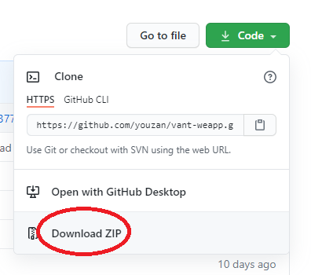

```
[2,2,2,2,1.6]  //5
item>=1.5  满星
1<=item<1.5  半星
item<1  没星
```

### 1-1 wx:if     wx:else

```js
<view class="container" wx:if="{{isShow}}">hello world</view>
<view wx:else>good</view>
```

```js
Page({
  data:{
    isShow:true
  }
})
```

### 1-2 wx:if  wx:elif  wx:else

```
if(){
    
}else if(){
    
}else{
    
}
```

```
<view class="container" wx:if="{{price>5000}}">苹果手机</view>
<view wx:elif="{{price>=3000}}">p30</view>
<view wx:else>oppo</view>
```

````js
Page({
    data:{
        price:6000,
        arr:[2,2,2,2,1.5]
    }
})
````

### 1-3 block

> 相当于一个占位符,不会在html页面上生成标签

```
<block wx:for="{{arr}}">
  <image wx:if="{{item>=1.5}}" src="/images/star.png"></image>
  <image wx:elif="{{item>=1}}" src="/images/ban-star.png"></image>
  <image wx:else src="/images/no-star.png"></image>
</block>
```

### 1-4 调用函数

```
onLoad(){
    this.show();
},
show(){
    console.log("show")
}
```

### 1-5 底部导航的配置

```
wa-app-tab
```

```js
"tabBar": {
    "color": "",
    "selectedColor": "",
    "backgroundColor": "",
    "position": "bottom",
    "borderStyle": "black",
    "list": [
      {
        "pagePath": "pages/movie/movie",
        "text": "电影",
        "iconPath": "",
        "selectedIconPath": ""
      },
      {
        "pagePath": "pages/music/music",
        "text": "音乐",
        "iconPath": "",
        "selectedIconPath": ""
      }
    ]
  },
```

### 1-6 onReachBottom

```
//页面到达底部的时候会触发
```

```
data:{
	playlists:[]
}
```

```
onLoad(){
    //15条 arr[15]
}
```

```
onReachBottom(){
    //1.  playlists  -->15
    //2.  http -->15
}
```

### 1-7 轮播

```js
<swiper 
//循环播放
circular = "{{swiperParams.circular}}"
//自动播放
autoplay = "{{swiperParams.autoplay}}"
//是否显示焦点
indicator-dots="{{swiperParams.dots}}"
//显示当前焦点的颜色
indicator-active-color= "{{swiperParams.activeColor}}"
//焦点默认的颜色
indicator-color="{{swiperParams.defaultColor}}">
    <swiper-item>
        <image src="/images/item.jpg"></image>
    </swiper-item>
    <swiper-item>
        <image src="/images/item.jpg"></image>
    </swiper-item>
    <swiper-item>
        <image src="/images/item.jpg"></image>
    </swiper-item>
</swiper
```

```js
Page({
    data: {
    swiperParams:{
      defaultColor:"#fff",
      dots:true,
      activeColor:"#ff2d51",
      autoplay:true,
      circular:true
    }
  }
})
```

### 1-8 wxs

> Tips:可以在模板中使用javascript对数据直接进行处理

```js
// 1-1 定义wxs文件  utils.wxs
//Tips:不支持es6的语法
function handleTitle(value){
    if (value.length >4) {
        return value.slice(0,4) + "..."
    }
    return value;
}
module.exports ={
    handleTitle:handleTitle
}
```

```js
//1-2  导入
//var tools = require("../../utils/utils.wxs")
      module  src
<wxs src="../../utils/utils.wxs" module="tools"></wxs>
//Tips:一定要放在页面的最上面
```

```js
//1-3 使用
<view>tools.handleTitle(name)</view>
```

### 作业

```js
1-1 http://192.168.4.18:8000/
http://192.168.4.18:8000/banner
要求:
1.封装http
2.使用wxs
http://192.168.4.18:8000/cart
1-2  使用vant-ui实现天猫购物车
```

### 1-9 vant-ui

#### 1  进入官网下载源码

```
https://github.com/youzan/vant-weapp
```



#### 2 解码文件,将`dist`目录拷贝到自己的项目中 

#### 3 使用

```js
https://vant-contrib.gitee.io/vant-weapp/#/intro
```

```js
3-1  需要在json文件中导入组件
{
  "usingComponents": {
    "van-button":"../../vant/dist/button/index"
  }
}
```

```js
3-2  使用
<van-button  type="danger">按钮</van-button>
```

### 1-10 vant-ui组件的介绍

#### 1-1 icon

```
<van-icon name="like-o" color="#ff2d51" info="9" size="30px" />
```

#### 1-2 checkbox

> Tips：原生的组件是没有bind:change这个事件的

```js
<van-checkbox value="{{isChecked}}" bind:change="onChange"></van-checkbox>

<checkbox value="你"  bindtap="handleChange"   checked="{{isChecked}}"></checkbox>

```

```js
Page({
  data: {
    isChecked:true
  },
  onChange(event){
    this.setData({
      isChecked:event.detail
    })
  },
  handleChange(){
    this.setData({
      isChecked:!this.data.isChecked
    })
  }
})
```

#### 1-3 search

```
<van-search
  value="你"
  shape="round"
  background="#ff2d51"
  placeholder="请输入搜索关键词"
  bind:change="onChange"
  bind:search="onSearch"
/>
```

```
<input type="text" 
bindinput="onChange" bindconfirm="onSearch"
></input>
```


```
onChange -->输入内容改变的时候触发   -->bindinput
onSearch -->点击回车按钮的时候触发   -->bindconfirm
```

### 1-11  reduce求和

> ##### Tips:当数组中是复杂数据类型时,失效

