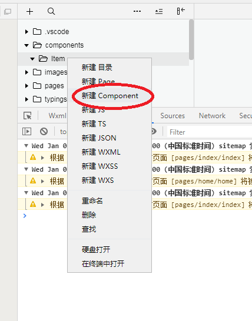
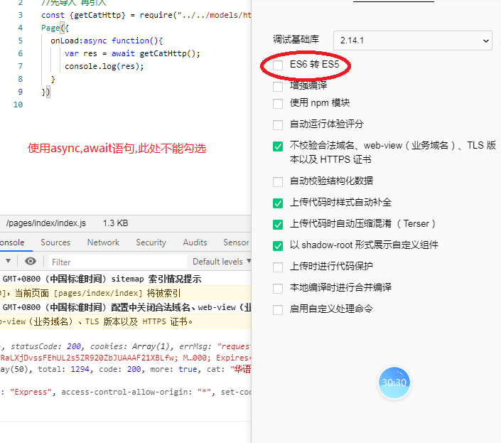

## 1 组件

### 1-2 新建组件



### 1-2 使用组件

```
//在页面的json文件在导入
{
  "usingComponents": {
    "v-item":"/components/Item/Item"
  }
}
```

```
//在wxml文件使用
<v-item></v-item>
```


### 1-3 父页面(组件)给子组件传参

```js
//1.给子组件(自定义一个属性)去接受父组件传递过来的参数
<v-item wx:for="{{playlists}}" data="{{item}}"></v-item>
```

```
//2.需要在子组件的properties属性中注册一下
Component({
  properties: {
      data:{
        type:Object
      }
  }
}）
```

```js
//3.在子组件中的页面使用
<view class="item">
    <image src="{{data.coverImgUrl}}"></image>
    <view>{{data.name}}</view>
</view>

```


### 1-4 组件的方法写在methods中的

## 2 async-await

